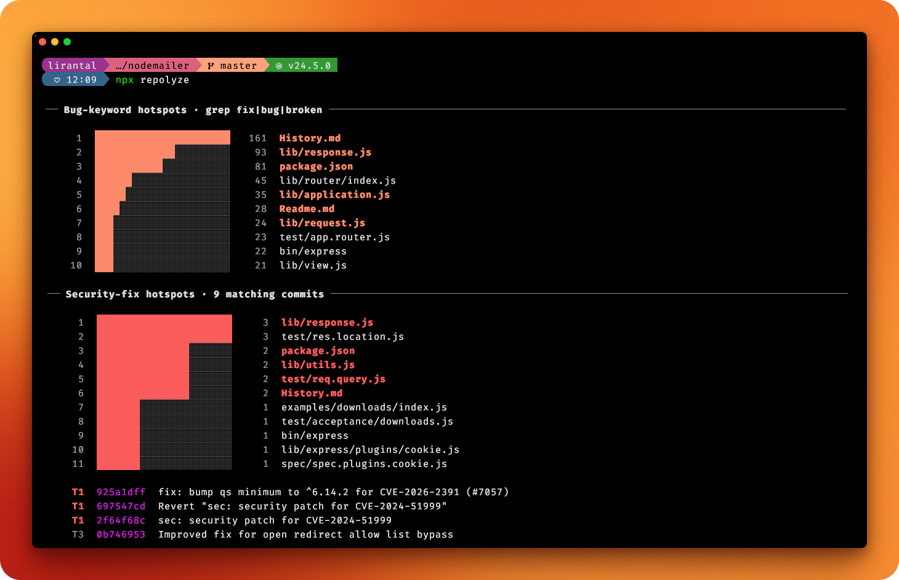
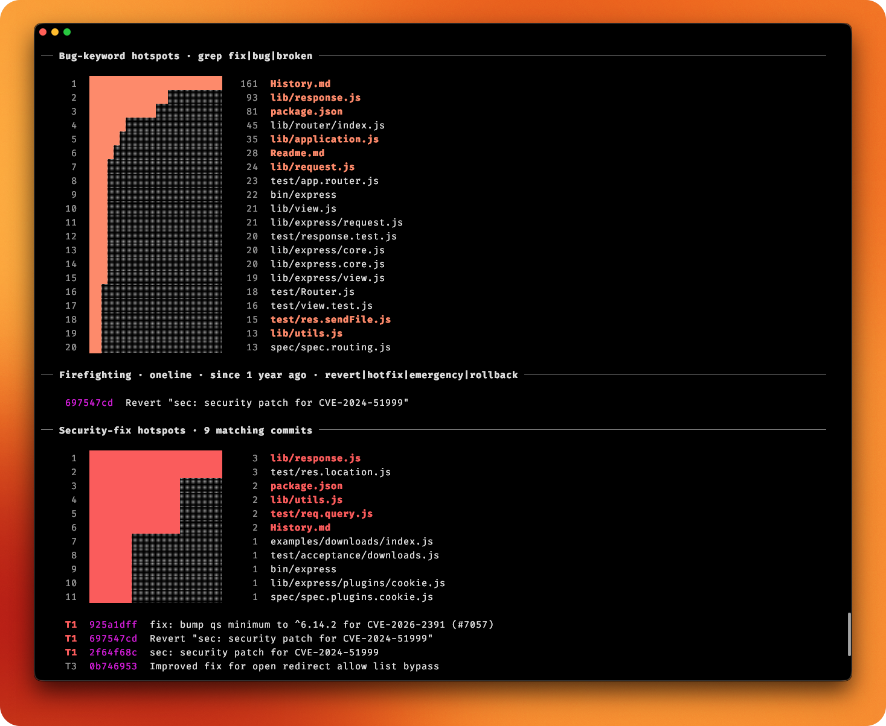
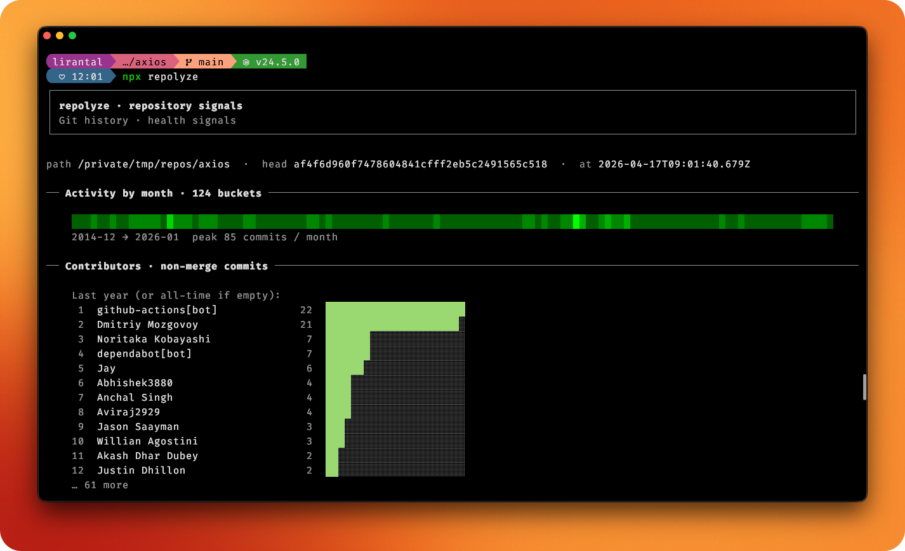

<!-- markdownlint-disable -->

<p align="center">
  <h1 align="center">
    repolyze
  </h1>
</p>

<p align="center">
  Analyze a git source code repository for health signals and project vitals
</p>

<p align="center">
  <a href="https://www.npmjs.com/package/repolyze"></a>
  <a href="https://www.npmjs.com/package/repolyze"></a>
  <a href="https://www.npmjs.com/package/repolyze"></a>
  <a href="https://github.com/lirantal/repolyze/actions?workflow=CI"></a>
  <a href="https://app.codecov.io/gh/lirantal/repolyze"></a>
  <a href="https://snyk.io/test/github/lirantal/repolyze"></a>
  <a href="./SECURITY.md"></a>
</p>

<p align="center">
  
</p>

## Usage

Analyze the current directory as a git repository and print JSON (for tooling or AI agents):

```bash
npx repolyze --json .
```

Analyze another path:

```bash
npx repolyze --json /path/to/repo
```

Verbose mode (prints `git` invocations to stderr):

```bash
npx repolyze --verbose .
```

Help:

```bash
npx repolyze --help
```

When the package is installed globally, use the `repolyze` command the same way (for example `repolyze --json .`).

## Screenshots

<p align="center">
  
</p>

<p align="center">
  
</p>

## Requirements

- [Node.js](https://nodejs.org/) v24 or newer
- [`git`](https://git-scm.com/) available on your `PATH`

## Install

Install globally (pick your package manager):

```sh
npm install -g repolyze
```

```sh
pnpm add -g repolyze
```

Or run **without** installing, using `npx` (downloads the package for that invocation):

```sh
npx repolyze --help
```

## Credits & References

The default signals this tool collects mirror the git workflow described by **Maciej Piechowski** in *[The Git Commands I Run Before Reading Any Code](https://piechowski.io/post/git-commands-before-reading-code/)*. See [docs/repository-analysis.md](./docs/repository-analysis.md) for command-by-command notes, caveats, and the same attribution in context.

References:

- [fallow-rs](https://github.com/fallow-rs/fallow) - Static analysis for source code health based on git

## Contributing

Please consult [CONTRIBUTING](./.github/CONTRIBUTING.md) for guidelines on contributing to this project.

**Developing this repo locally** (running from source, tests, build): see [DEVELOPMENT.md](./DEVELOPMENT.md).

## Author

**repolyze** © [Liran Tal](https://github.com/lirantal), Released under the [Apache-2.0](./LICENSE) License.
